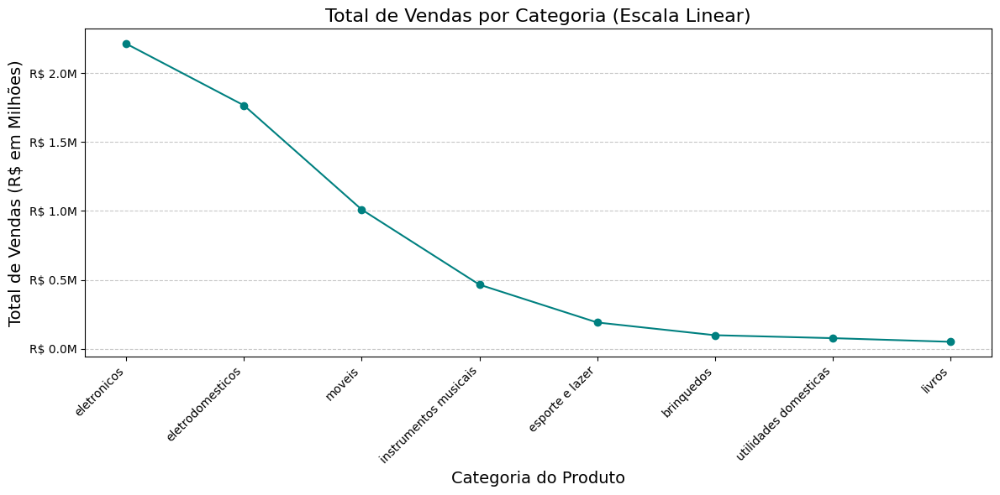
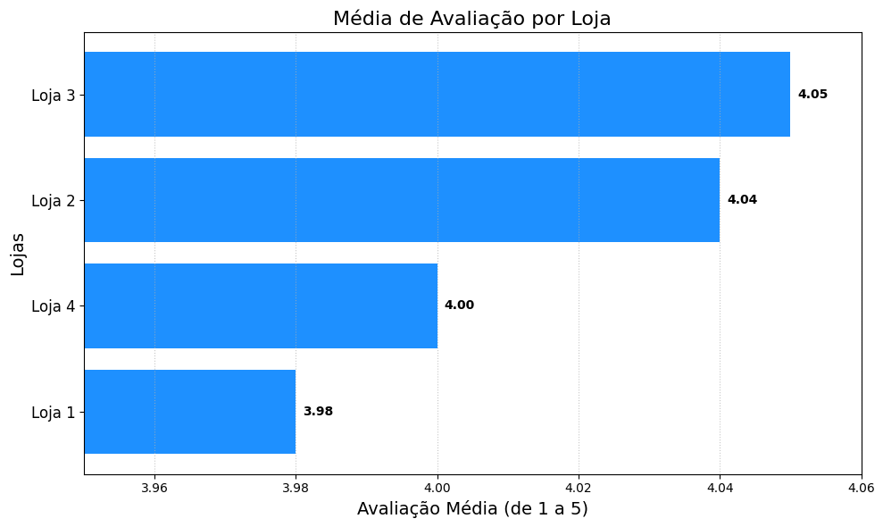

# Desafio Alura Store Brasil

## Descrição do Projeto
Este projeto foi desenvolvido como parte do Desafio Alura Store Brasil, que consiste em analisar dados de vendas de 4 lojas do Seu João. O objetivo é ajudar o Senhor João a decidir qual loja da sua rede Alura Store vender para iniciar um novo empreendimento.

## Objetivos
- Consolidar os dados de várias lojas em um único DataFrame.
- Analisar o faturamento total de cada loja.
- Identificar as categorias de produtos mais vendidas.
- Examinar a evolução temporal das vendas.

## Metodologia
1. **Importação dos Dados**: Os dados foram carregados a partir de quatro arquivos CSV, cada um representando uma loja diferente.
2. **Limpeza e Preparação dos Dados**: Foi adicionada uma coluna 'Loja_id' para identificar a loja de origem de cada registro.
3. **Análise Exploratória**: Foram realizadas análises para entender o faturamento por loja, categorias de produtos, e a temporalidade das vendas.

## Principais Descobertas
- A Loja 1 foi a que mais contribuiu para o faturamento total, seguida pela Loja 2, Loja 3 e Loja 4.
- A categoria de produtos 'eletronicos' foi a que apresentou maior faturamento.
- A Loja de maior avaliação, não é a que mais vende(Loja 4).

## Gráficos

### 1. Faturamento por Loja

Este gráfico de pizza mostra a participação de cada loja no faturamento total. A Loja 1 possui a maior fatia, representando X% do total.

### 2. Vendas por Categoria de Produto

O gráfico de barras exibe a quantidade de vendas por categoria de produto. A categoria 'eletronicos' lidera em volume de vendas.

### 3. Média de Avaliação por Loja

O gráfico de linha apresenta a evolução das vendas ao longo do tempo, permitindo identificar tendências e sazonalidades.

### 🎯 Recomendação Estratégica Final

**Venda da Loja 4**

- **Justificativa:**

- Menor faturamento entre todas as unidades

- Menor potencial de crescimento identificado

- Ponto de menor retorno do portfólio

- Libera recursos para investir nas lojas mais lucrativas (Loja 1)

- Permite focar nas unidades com melhores avaliações (Lojas 2 e 3)

  ## Como Executar o Projeto

### Pré-requisitos
- Python 3.x
- Jupyter Notebook
- Bibliotecas: pandas, matplotlib, seaborn

### Instalação
1. Clone o repositório:
   ```bash
   git clone https://github.com/seu-usuario/desafio-alura-store-brasil.git

### 🤝 Contribuições ###
**Contribuições são muito bem-vindas! Se você tiver sugestões de melhoria para a análise (outras métricas, novas visualizações, ou refatoração do código), sinta-se à vontade para contribuir.
Faça um Fork do projeto.**
- Crie uma nova branch para sua feature (git checkout -b feature/nova-analise).
- Commit suas alterações (git commit -m 'feat: Adiciona análise de margem de lucro').
- Faça o Push para a sua branch (git push origin feature/nova-analise).
- Abra um Pull Request (PR) detalhando as mudanças propostas.


